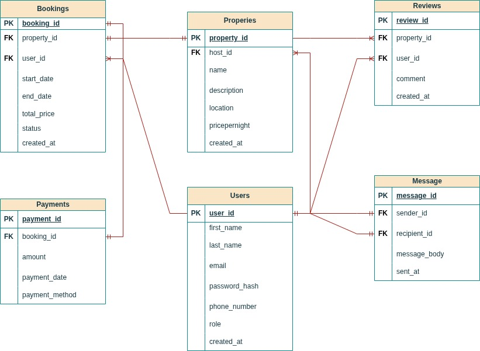

# Table Relationships

## 1. User Table
The `users` table is the central entity in the schema.  
Each user can have one of three roles:
- **Guest:** Can make bookings and write reviews.
- **Host:** Can list properties.
- **Admin:** Can manage users and data (optional role, not directly referenced by other tables).

### Relationships:
- **1-to-Many with Properties:**  
  One host (`users.user_id`) can own multiple properties (`properties.host_id`).

- **1-to-Many with Bookings:**  
  One guest (`users.user_id`) can make multiple bookings (`bookings.user_id`).

- **1-to-Many with Reviews:**  
  One guest (`users.user_id`) can write multiple reviews (`reviews.user_id`).

- **Self-Referential 1-to-Many with Messages:**  
  A user can send and receive multiple messages.  
  - `messages.sender_id` → `users.user_id`  
  - `messages.recipient_id` → `users.user_id`

---

## 2. Property Table
Each record represents a rental property listed by a host.

### Relationships:
- **Many-to-One with User (Host):**  
  Each property belongs to exactly one host.  
  - `properties.host_id` → `users.user_id`

- **1-to-Many with Bookings:**  
  A property can have many bookings by different guests.  
  - `bookings.property_id` → `properties.property_id`

- **1-to-Many with Reviews:**  
  A property can have many reviews written by different guests.  
  - `reviews.property_id` → `properties.property_id`

---

## 3. Booking Table
Represents a reservation made by a guest for a specific property.

### Relationships:
- **Many-to-One with Property:**  
  Each booking is for a specific property.  
  - `bookings.property_id` → `properties.property_id`

- **Many-to-One with User (Guest):**  
  Each booking is made by a specific guest.  
  - `bookings.user_id` → `users.user_id`

- **1-to-1 (or 1-to-Many) with Payments:**  
  Each booking can have one or more associated payments, depending on business logic.  
  - `payments.booking_id` → `bookings.booking_id`

---

## 4. Payment Table
Represents a payment made for a booking.

### Relationships:
- **Many-to-One with Booking:**  
  Each payment is linked to exactly one booking.  
  - `payments.booking_id` → `bookings.booking_id`

- Indirectly related to:
  - The **guest** who made the booking.
  - The **property** and **host** that received payment.

- Thus, payments form a **chain relationship:**

## 5. Review Table
Stores feedback given by guests for properties they booked.

### Relationships:
- **Many-to-One with Property:**  
  Each review is written about a specific property.  
  - `reviews.property_id` → `properties.property_id`

- **Many-to-One with User (Guest):**  
  Each review is written by a specific guest.  
  - `reviews.user_id` → `users.user_id`

**Indirect Relationships:**
- Through these links, reviews connect the **guest** who wrote it and the **host** who owns the reviewed property.

---

## 6. Message Table
Represents private messages exchanged between users (e.g., guests asking hosts questions).

### Relationships:
- **Self-Referential Many-to-One with User:**
  - `messages.sender_id` → `users.user_id`
  - `messages.recipient_id` → `users.user_id`

**Behavior:**
- A single user can send many messages.
- A single user can receive many messages.
- Together, this forms a **many-to-many relationship between users**, implemented via the `messages` table.